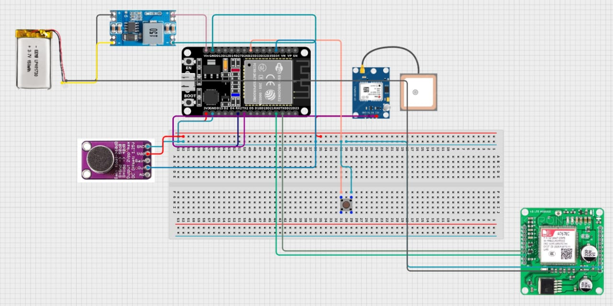

# 🚨 MITR SOS – AI-Powered Emergency Response System



**MITR SOS** is a full-stack, hardware-integrated emergency alert system that detects distress (via AI or manual trigger) and instantly notifies trusted contacts with a live GPS tracking link.

Unlike typical apps, MITR operates **independently of a smartphone**, using an embedded device with GSM/GPS capabilities and a real-time web dashboard for monitoring.

---

## 🔥 Key Highlights

* 🧠 **On-device AI detection (TinyML)** for scream/distress recognition
* 📡 **Fully independent hardware system** (no phone required)
* 📍 **Real-time GPS tracking** with shareable live link
* 📲 **Instant SMS alerts** to emergency contacts
* 🌐 **Live tracking dashboard** (React-based web app)
* 🔄 **Offline recovery with buffered sync**
* 🔐 **Secure reset & access control system**

---

## 🏗️ System Architecture

MITR consists of **three tightly integrated layers**:

### 1. 🔌 Embedded System (ESP32 + A7670C)

* AI-based scream detection using **TensorFlow Lite Micro**
* Manual SOS trigger button
* GSM module for SMS + HTTP communication
* GPS module for real-time location
* Bluetooth for configuration (contacts, sensitivity)
* Offline storage for network failure scenarios

---

### 2. ⚙️ Backend (Flask + MongoDB)

* REST API for device communication and tracking
* Stores GPS logs, device states, and triggers
* Authentication & secure device reset system
* Handles offline data sync and recovery

---

### 3. 🌍 Frontend (React + Vite + Tailwind)

* Live tracking dashboard (`/track?id=DEVICE_ID`)
* Admin reset panel for device control
* Historical SOS logs with timestamps

---

## 📂 Project Structure

```
MITR-SOS/
├── embedded/              # ESP32 firmware (TinyML + GSM + GPS)
│   └── MitrSOSDevice.ino
│
├── backend/              # Flask backend (API + DB)
│   ├── controllers/
│   ├── models/
│   ├── routes/
│   ├── middleware/
│   └── app.py
│
├── frontend/             # React app (Vite + Tailwind)
│   ├── src/
│   └── public/
│
├── structure.jpeg        # Architecture diagram
└── README.md
```

---

## ⚙️ Tech Stack

| Layer          | Technologies                                  |
| -------------- | --------------------------------------------- |
| **Hardware**   | ESP32-S3, A7670C (GSM + GPS), Arduino         |
| **AI/ML**      | TensorFlow Lite for Microcontrollers (TinyML) |
| **Backend**    | Python, Flask, MongoDB                        |
| **Frontend**   | React.js, Vite, TailwindCSS                   |
| **Deployment** | Render (API), Vercel (Frontend)               |

---

## 🔄 End-to-End Workflow

1. 🚨 Distress detected (AI scream detection or button press)
2. 📍 Device captures GPS coordinates
3. 🌐 Data sent to backend API
4. 📩 SMS with tracking link sent to emergency contacts
5. 🗺️ Contacts view real-time location via web dashboard
6. 🔐 System remains locked until authorized reset

---

## 🔁 Offline Resilience

* 📦 Stores GPS data locally when network is unavailable
* 🔄 Automatically syncs all logs when connectivity is restored
* ⏱️ Maintains chronological event order

---

## 🔐 Security & Privacy

* Contacts stored **locally on device only**
* Secure API communication with authentication keys
* No third-party tracking or data sharing
* Access-controlled reset functionality

---

## 🚀 Live Deployment

* 🌍 **Frontend (Live Tracking)**: [https://mitr-beta.vercel.app/](https://mitr-beta.vercel.app/)
* ⚙️ **Backend API**: [https://mitr-new-api.onrender.com/](https://mitr-new-api.onrender.com/)

---

## 🧪 Local Setup

### 🔧 Backend (Flask)

```bash
cd backend
python -m venv venv
source venv/bin/activate   # Linux/macOS
# OR venv\Scripts\activate (Windows)

pip install -r requirements.txt
python app.py
```

Create a `.env` file:

```ini
PORT=5000
MONGO_URI=your_mongodb_uri
JWT_SECRET=your_secret
```

---

### 🌐 Frontend (React)

```bash
cd frontend
npm install
npm run dev
```

---

### 🐳 Docker (Optional)

```bash
docker-compose up --build
```

---

## 🧩 Future Enhancements

* 🎙️ Voice keyword detection
* 🧠 Emotion recognition from audio
* 🔋 Battery monitoring via Bluetooth
* 📱 Dedicated Android app
* 🛰️ Satellite fallback communication

---

## 💡 Why MITR Stands Out

* Combines **IoT + AI + Full-stack development**
* Works in **real-world emergency conditions (offline support)**
* Designed for **safety-critical use cases**
* Demonstrates **system design + hardware-software integration**

* Add **GitHub badges + visuals**
* Or rewrite it specifically for **recruiters (impact-focused version)**
